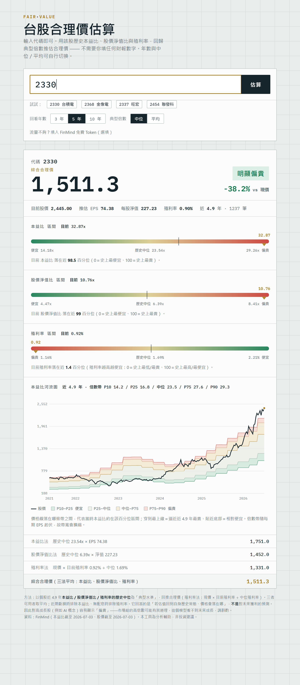
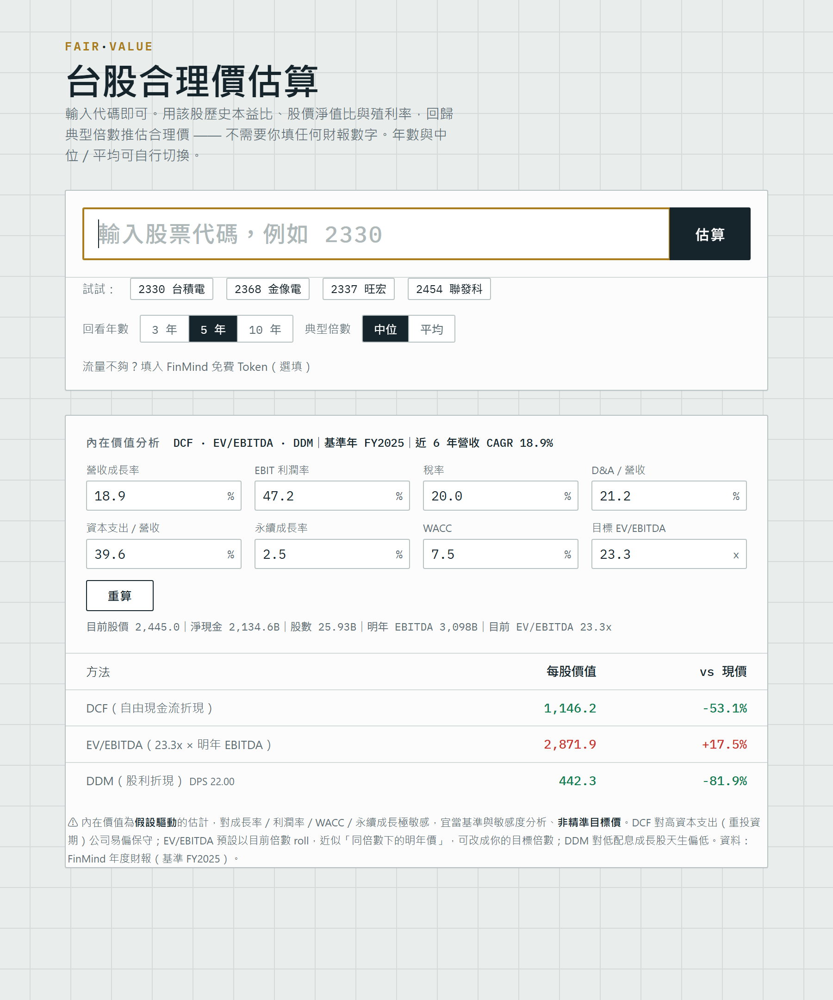

# 台股合理價估算器 · Taiwan Stock Fair-Value Estimator

一支**零安裝、單檔**的 Python 網頁小工具：只要輸入台股代碼（例如 `2330`、`2368`、`2337`），
就自動抓資料估出**預估合理價**。兩層估值：**①歷史倍數回歸**（不需任何輸入）＋**②內在價值模型
（DCF / EV-EBITDA / DDM）**，後者自動用財報預填假設、可即時微調。

<p align="center">
  
</p>

> ⚠️ 本工具僅供分析與學習用途，**非投資建議**。它回答的是「若估值回到自身歷史常態、價格會落在哪」，
> 並非對未來獲利的預測；對高成長股（如 AI 概念）容易顯示「偏貴」。

## 執行方式

只需 Python 3.8+，**不需安裝任何套件**（純標準函式庫）：

```bash
python 台股合理價估算器.py      # Windows
python3 台股合理價估算器.py     # macOS / Linux
```

程式會自動開啟瀏覽器介面（本機 `http://127.0.0.1:8787`，埠若被占用會自動往後找）。
按 `Ctrl+C` 結束。

## 估值方法

以個股的**歷史典型水準**為錨，回歸推估合理價。**回看年數（3／5／10 年）** 與**典型倍數（中位／平均）** 都可在介面即時切換。目前綜合三種方法（可用者取平均）：

| 方法 | 公式 | 排除條件 |
|---|---|---|
| 本益比法 P/E | 歷史中位 PER × 推估 EPS | 近期虧損時排除 |
| 股價淨值比法 P/B | 歷史中位 PBR × 每股淨值 | — |
| 殖利率法 Dividend yield | 現價 × 目前殖利率 ÷ 中位殖利率 | 無配息／剛停息時排除 |

其中推估 EPS、每股淨值皆由「現價 ÷ 目前倍數」反推，不讀真實財報，故完全依賴資料來源當前的
PER / PBR / 殖利率快照。介面另提供：

- 本益比 / 股價淨值比 / 殖利率的**歷史區間儀表（gauge）**，標示目前落點的百分位。
- **本益比河流圖**：五條倍數帶（P10 / P25 / 中位 / P75 / P90）疊在歷史股價上。

**顏色慣例（台股）**：紅＝偏低／上漲潛力、綠＝偏貴／下跌潛力。

## 內在價值分析（DCF · EV/EBITDA · DDM）

歷史回歸看的是「估值回到常態」，看不到未來成長；因此另加一層**內在價值模型**。點結果下方的
「展開內在價值分析」即會**自動抓取 FinMind 年度三表財報**，用歷史數字**預填假設**並算出三法估值——
所有假設（營收成長、EBIT 利潤率、稅率、D&A%、資本支出%、永續成長、WACC、目標 EV/EBITDA）
都可**即時編輯、按「重算」重跑**。

<p align="center">
  
</p>

| 方法 | 說明 |
|---|---|
| **DCF** | 五年自由現金流（FCFF）折現 + 永續成長終值；WACC 以 CAPM 自動估算 |
| **EV/EBITDA** | 以目前（或自訂目標）倍數 × 明年 EBITDA，扣淨負債得每股值 |
| **DDM** | Gordon 股利折現（僅對穩定配息股有意義） |

> ⚠️ 內在價值為**假設驅動**的估計，對成長率／利潤率／WACC／永續成長極敏感，宜當基準與敏感度分析、
> **非精準目標價**。DCF 對重資本支出公司易偏保守；DDM 對低配息成長股天生偏低。

**財報年度化慣例（實測）**：FinMind 損益表為**單季**值（全年＝四季相加）、現金流量表為**累計 YTD**
（全年＝12/31 那筆）、股數＝稅後淨利 ÷ EPS。

## 資料來源

[FinMind Open Data](https://finmind.github.io/) — `https://api.finmindtrade.com/api/v4/data`

- `TaiwanStockPER` → `{date, stock_id, dividend_yield, PER, PBR}`（每日）
- `TaiwanStockPrice` → `{date, stock_id, ..., close, ...}`（每日）
- `TaiwanStockFinancialStatements` / `TaiwanStockBalanceSheet` / `TaiwanStockCashFlowsStatement`（季度，供內在價值模型）
- 免費上限 300 次/小時；註冊免費 Token 後 600 次/小時（介面有選填欄位）。

## 授權

MIT License，詳見 [LICENSE](LICENSE)。
